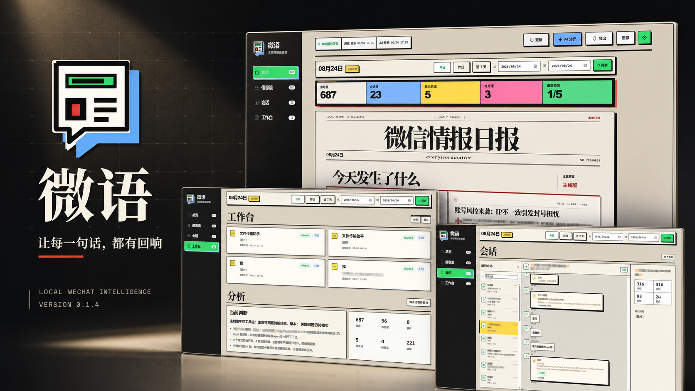

<div align="center">
  <a href="https://github.com/Sutera-Diffusus/WeChat-daily">
    
  </a>
  <h1>LiteChat</h1>
  <p>A local-first Windows workspace for WeChat briefings, history, and intelligence analysis.</p>
  <p>
    <a href="README.md">中文 README</a>
    ·
    <a href="https://github.com/Sutera-Diffusus/WeChat-daily/releases/tag/v0.1.4">v0.1.4 Release</a>
  </p>

  <p>
    <a href="CHANGELOG.md"></a>
    <a href="https://github.com/Sutera-Diffusus/WeChat-daily/releases/tag/v0.1.4"></a>
    <a href="https://github.com/Sutera-Diffusus/WeChat-daily/releases/download/v0.1.4/weiyu-0.1.4-windows-installer.exe"></a>
    <a href="https://github.com/Sutera-Diffusus/WeChat-daily/releases/download/v0.1.4/weiyu-0.1.4-windows-portable.zip"></a>
    <a href="LICENSE"></a>
  </p>

  <p>
    <a href="https://github.com/Sutera-Diffusus/WeChat-daily/releases/download/v0.1.4/weiyu-0.1.4-windows-installer.exe">Download installer</a>
    ·
    <a href="https://github.com/Sutera-Diffusus/WeChat-daily/releases/download/v0.1.4/weiyu-0.1.4-windows-portable.zip">Download portable</a>
    ·
    <a href="docs/images/product-preview/overview.png">Product preview</a>
  </p>

  <p>
    <a href="https://www.python.org/"></a>
    <a href="desktop/"></a>
    <a href="https://github.com/Sutera-Diffusus/WeChat-daily/releases"></a>
  </p>
</div>

> <code>WeChat → adapter → normalized messages → SQLite → daily / weekly archive → explainable analysis → LiteChat workspace</code>
>
> From v0.1.4 onward, LiteChat’s product boundary is <strong>permanently read-only</strong>: it receives, syncs, and analyzes; it does not auto-reply, manually send, or plan to add sending as a future feature.

---

## What LiteChat does

LiteChat lives on your Windows machine and turns scattered WeChat conversations into dated, traceable briefings. It keeps the original context, gives each conclusion a way back to its source message, and leaves the final decision with you. The default workflow receives and analyzes local data; it does not send messages automatically. “Local by default” is not a promise of zero account risk or that no data can ever leave the computer; read the boundary below first.

The workflow is simple:

`collect → archive → filter → explain → review`

## Read this first: risk, data, and compliance boundaries

- **The account-ban risk is not something this project can call small.** LiteChat is not an official WeChat product. Reading, syncing, or parsing the local WeChat database, using unofficial adapters, or probing internal WeChat behavior may trigger platform controls, account restrictions, temporary bans, or permanent bans. The project cannot promise safety or “no ban”; treat a primary account used for daily social and work communication as exposed to a materially significant risk. Read-only mode does not transfer that risk to the project.

### Where does the account-ban risk mainly come from?

“Materially significant risk” does not mean that launching LiteChat guarantees a ban, nor is it an honest percentage estimate: WeChat does not publish enough detection rules or hit-rate data. It is a risk classification across different exposure surfaces. The most direct exposure comes from letting a third-party program read or operate WeChat outside official interfaces, not from LiteChat’s own local `data/wechat_bridge.db` SQLite file:

| Exposure | What the code actually does | Risk view | Default |
| --- | --- | --- | --- |
| Unofficial local database access | `wechatauto_db` uses `wechatauto-replica` to open encrypted message shards under WeChat `xwechat_files`, read message/contact/media indexes, and poll for changes | Local reads may not immediately create a server-side ban signal, but they touch internal database formats, decryption, and undocumented structures; this is a major broad reverse-engineering/compliance exposure | Default Windows adapter; read-only |
| Window automation | `wxauto4` connects to the running WeChat window and listens/polls chats; it also retains a `SendMsg` path | Third-party control of the client is more automation-like than a local file read; sending raises the account exposure substantially | Fallback, not desktop default |
| Hook / injection path | `hook_http` talks to an already-running local Hook service, receives `D0003` callbacks, and exposes a `SendTextMsg` call | Hook DLLs, process injection, and protocol/callback parsing are the highest technical and legal exposure. LiteChat does not download or inject a DLL itself, but an external Hook is still not an official interface | Not default; requires an external Hook |
| Actual message sending | Only after `--live`, `--enable-sending`, confirmation, chat allowlisting, and target guards does it call the visible client or Hook send method | The most direct account-ban exposure: frequency, repetition, bulk reach, unusual targets, and unattended behavior can turn internal-data access into account automation | Disabled in release package |
| AI / ASR transfer | Manual AI analysis sends candidate text; Doubao transcription sends selected voice audio | Primarily a privacy/provider-retention risk, not the core account-ban vector; it becomes an additional account risk only when combined with automated sending | User-enabled |

As a rough exposure ordering: **actual sending/automation > Hook or injection > unofficial database parsing > local rule analysis alone**. This is not an official WeChat probability ranking; it is a risk layering based on control level and platform visibility. A read-only database read may not produce obvious network sending, so it would be wrong to claim that one read guarantees a ban. It can still violate platform rules, be treated as abnormal client/internal-data access, or become much riskier when combined with a Hook, UI automation, broader chat scope, or sending.

The default Windows package starts its backend without `--live` or `--enable-sending`, and the normal workspace does not send messages; it does, however, read the local WeChat database. That is “read-only,” not “risk-free.” If a user enables `--live`, `--enable-sending`, `--allow-other-chats`, `wxauto4`, a Hook service, or UIA hot activation, the exposure is materially above the default release path and should not be described as an ordinary read-only tool.

### Sync-use guidance

Sync reads local WeChat data. Even though LiteChat is currently read-only, it cannot rule out platform controls, account restrictions, or other compliance risk. Sync only when necessary, avoid repeated clicks or immediate retries after a failure, and— as a conservative initial guideline—keep manual historical syncs to no more than 2–3 times per day and spread them out. This is not a safety threshold or a no-ban guarantee; follow WeChat’s platform rules and carefully assess whether to use a primary account.

The “auto-fetch new messages” setting only reads the local LiteChat workspace; it does not initiate historical sync. The “Sync” action in the date-range toolbar is what scans the local WeChat history database. Both are read-only, but read-only does not mean risk-free.

- **“The full WeChat database is not uploaded” has a concrete meaning.** The default intake, history sync, rule analysis, and desktop communication run locally; the project does not automatically send a database file or full database to the project author. Data leaves the machine only when you explicitly enable an external service:
  - After you manually confirm a second-pass AI analysis, the configured AI provider receives a limited candidate set: candidate text (up to 360 characters per item), up to 8 nearby same-chat snippets (up to 240 characters each), timestamps, chat names, sender names/aliases, self/group flags, rule signals, candidate state/type, topic/event summaries, counts, and evidence references. The default limit is 120 candidates and the API maximum is 200. Common `wxid` / `gh_` identifiers, local paths, MD5 values, emails, and phone numbers are replaced, but this is not anonymization; message text, names, chats, and times can still identify people.
  - If native local transcription is unavailable and you enable Doubao ASR and click transcription, LiteChat decodes the selected WeChat voice locally and sends the audio to Doubao. This is not text-only transfer; retention and processing follow the provider’s terms and privacy policy.
  - If you actively use the Codex plugin to read messages, the returned message content is handed to the client/model invoking that plugin. That path is outside the default local-workspace boundary and must be assessed under the caller’s data policy.
  - Ordinary local sync does not automatically upload the full database, cookies, WeChat login state, or the entire media directory; self-configured AI, ASR, Hook, or other endpoints are outside that guarantee.
- **Read-only is a permanent product boundary, not a temporary status.** “Read-only / dry-run” is not a soft way of saying that automatic sending may arrive later. LiteChat will not implement or expose auto-replies, automatic sending, bulk sending, or sending on the user’s behalf, and will not plan these as future features. The supported workflow only receives, syncs, organizes, analyzes, and links evidence; the user retains all decisions and any action inside WeChat.
- **Tencent legal and broad reverse-engineering risk must be taken seriously.** Hooking, database decryption, protocol parsing, feature parsing, or parsing information inside WeChat may be viewed by the platform or rights holder as unauthorized reverse engineering, cracking, or prohibited automation; public community/forum feedback has also described multiple related projects or promotions receiving lawyer letters (this document does not independently determine the facts or legal liability of any case). “Read-only,” “no injection,” and “no automatic sending” do not establish legality or immunity from enforcement. Follow the current [WeChat Software License and Service Agreement](https://weixin.qq.com/agreement?lang=zh_CN), platform rules, and applicable law; account, data, compliance, and legal risks remain with the user. This is not legal advice.

## Launch poster



## Contents

- [Features](#features)
- [What LiteChat does](#what-litechat-does)
- [Read this first: risk, data, and compliance boundaries](#read-this-first-risk-data-and-compliance-boundaries)
- [Product feedback and iteration checklist](docs/product-feedback-checklist.md)
- [Launch poster](#launch-poster)
- [Product preview](#product-preview)
- [Downloads](#downloads)
- [Detailed features](#detailed-features)
- [Requirements](#requirements)
- [Quick start](#quick-start)
- [Beginner tutorial](#beginner-tutorial)
- [LiteChat workspace](#litechat-workspace)
- [Desktop app](#desktop-app)
- [Rules and AI](#rules-and-ai)
- [API and Codex plugin](#api-and-codex-plugin)
- [Data and privacy](#data-and-privacy)
- [Project structure](#project-structure)
- [Development and tests](#development-and-tests)
- [Current boundaries](#current-boundaries)
- [License](#license)

## Features

### Local message intake

- `wechatauto_db` reads readable message shards from the local WeChat 4.x database;
- `wxauto4` remains available as an explicit fallback adapter;
- the Hook HTTP layer keeps `QueryDB/status`, `SendTextMsg`, and `D0003` callback adapters;
- one message model covers chat, sender, type, group flag, media key, and evidence ID;
- deduplication, sync tasks, retries, send attempts, errors, and confirmations are stored in local SQLite.

### Daily and weekly archive

- supports today, the last 7 days, and custom date ranges;
- reads across readable chats and encrypted message shards without duplicating messages on repeated runs;
- interprets date boundaries as `Asia/Shanghai` half-open intervals;
- records the sync range, progress, and latest run state for troubleshooting.

### Explainable intelligence analysis

- message volume, active chats, hourly distribution, and topic overview;
- key leads, action candidates, event windows, and risk hints;
- conclusions keep original message evidence IDs and can link back to specific messages;
- rules can match keywords, regular expressions, chats, senders, message types, time ranges, and time zones.

### Local console and desktop wrapper

- the browser workspace binds to `127.0.0.1:8765` and shows archives, summaries, leads, and action candidates;
- message archives support filtering, search, and evidence links;
- the Tauri 2 desktop app reuses the local service and can start its bundled backend when needed;
- the desktop app does not expose frontend shell access, does not pass `--live`, and only stops the backend process that it started.

### Codex local plugin

`plugins/wechat-bridge` provides local MCP tools for status, messages, rules, and analysis. It calls the same loopback API and does not bypass the read-only boundary.

## Product preview

These are screenshots of the local LiteChat workspace. Chat names, contacts, and parts of the message text have been blurred. The images show layout only; no runtime chat database is committed to the repository.

| Page | Description |
| --- | --- |
|  | **Overview / daily thread**: choose a date range, review message volume, chat count, key candidates, pending items, and speech transcription progress, then read what happened today. [Open image](docs/images/product-preview/overview.png) |
|  | **Daily edition**: turns high-signal messages into a readable page with topics, judgments, tags, and an evidence appendix. [Open image](docs/images/product-preview/daily-edition.png) |
|  | **Small things**: keeps lower-signal messages that may matter later without mixing them into the main thread or losing them completely. [Open image](docs/images/product-preview/small-things.png) |
|  | **Conversations**: browse original messages by chat, inspect image, file, and voice types, and return to the original evidence. [Open image](docs/images/product-preview/conversations.png) |
|  | **Workbench / analysis**: review pending candidates, event threads, topics, current judgments, and analysis metrics in one place. The default mode is read-only. [Open image](docs/images/product-preview/workbench.png) |

## Downloads

Windows release packages for LiteChat 0.1.4 are available from [GitHub Release v0.1.4](https://github.com/Sutera-Diffusus/WeChat-daily/releases/tag/v0.1.4). The installer and portable package are Release assets because they are larger than the normal single-file repository limit.

- [Download the Windows installer](https://github.com/Sutera-Diffusus/WeChat-daily/releases/download/v0.1.4/weiyu-0.1.4-windows-installer.exe): run the setup wizard, then launch LiteChat from the Start menu or desktop shortcut;
- [Download the Windows portable package](https://github.com/Sutera-Diffusus/WeChat-daily/releases/download/v0.1.4/weiyu-0.1.4-windows-portable.zip): extract the full folder and run `wei-daily-desktop.exe` inside it;
- [Open the Release page](https://github.com/Sutera-Diffusus/WeChat-daily/releases/tag/v0.1.4): view release notes, file sizes, and other checks.

Verify downloads with these SHA256 values:

| File | SHA256 |
| --- | --- |
| `weiyu-0.1.4-windows-installer.exe` | `100FFFA7E7C965B55B07771CAFE082A3A342DC782637156B1258874F2974D80E` |
| `weiyu-0.1.4-windows-portable.zip` | `1FA52D8E19967DFEB1D4E2F090BE298713C548F4E856B4DA8912052671D9F974` |

## Detailed features

LiteChat is not only a chat history viewer. It is a local workflow for collection, archiving, filtering, explanation, and review. Messages stay in a dated context with a source and evidence path.

### 1. Message collection

- `wechatauto_db` reads readable message shards from the local WeChat 4.x database;
- `wxauto4` is an explicit fallback for environments that need to read through the WeChat window;
- the Hook HTTP layer keeps `QueryDB/status`, `SendTextMsg`, and `D0003` callbacks for existing local bridge services;
- every source is normalized into one model with chat, sender, timestamp, message type, group flag, media key, and evidence ID;
- deduplication, sync progress, task state, retry records, errors, and confirmations go to local SQLite.

The main path does not download DLL files, inject WeChat, or replace files in the WeChat installation directory. Receive and analysis access local data and loopback services only.

### 2. History archive

The workspace supports today, the last 7 days, and custom date ranges. Dates use `Asia/Shanghai` half-open intervals, which keeps cross-midnight and cross-day sync boundaries predictable.

Each sync records its range, progress, and latest run state. Adapters search readable chats and database shards and use stable message identifiers for deduplication. This supports both daily updates and a first-time catch-up for the previous week.

### 3. Daily edition

The daily page organizes messages by signal:

- **Main thread**: the topics, changes, and events worth reading first;
- **Key candidates**: messages that may need attention, follow-up, or judgment;
- **Event threads**: messages about one event across different times and chats;
- **Topics**: where discussion is concentrated by keyword, chat, sender, or type;
- **Small things**: lower-signal messages that may still matter later;
- **Evidence appendix**: original message evidence IDs for every judgment.

The daily edition does not treat model output as a final answer. Local rules filter and label messages first. The analysis layer calculates volume, active chats, hourly distribution, topics, and candidates. If the user enables AI, AI performs a second pass and must cite local evidence IDs. Conclusions without a traceable link are discarded.

### 4. Conversation browser

The conversation page provides a path from a summary back to evidence: find a chat on the left, inspect message text and image, file, or voice types in the center, and view chat statistics on the right. Media fields keep local media keys or paths for further checking on the same machine.

A daily highlight is a sorting aid, not an automatic decision. Conversation browsing itself never sends a message.

### 5. Workbench

The workbench puts pending candidates, event threads, topics, and analysis metrics in one view. Each candidate should include a source, time, rule or analysis reason, and evidence link so that the user can see why it appeared and decide what to do next.

Statuses such as pending and confirmed describe local organization only. They do not mean that anything was sent to a WeChat contact. LiteChat’s product boundary is permanently read-only; previews and analysis are for local organization or user-configured external analysis and never create a WeChat send task.

### 6. Rules and AI

Rules support keywords, regular expressions, chats, senders, message types, time ranges, and time zones. A practical order is:

1. use rules to narrow the message range and add labels;
2. inspect candidates by date, chat, and message type;
3. return to the original evidence and confirm context;
4. manually confirm a second AI pass only when it is useful;
5. check that every AI result links back to local evidence.

This keeps both privacy exposure and analysis cost under control. AI does not participate in automatic replies, write to the message database, enter a reply queue, or trigger a WeChat action after analysis.

### 7. Desktop app and Codex plugin

The Tauri 2 desktop app reuses the same local service. If `127.0.0.1:8765` is already available, it connects to it; otherwise it starts its bundled backend. The frontend has no shell permission, the app does not pass `--live`, and closing the app stops only the process it started.

`plugins/wechat-bridge` exposes status, recent messages, rule analysis, and preview tools to Codex. It still uses the same loopback API, so the read-only mode and send guard do not change when the entry point changes.

## Requirements

### For regular users

| Item | Requirement |
| --- | --- |
| Operating system | Windows 10 / 11 |
| WeChat | Signed in, with the main window open |
| WebView2 | Required by the Windows desktop app; install it before launching the portable package if it is missing |

Regular users do not need Python, Node.js, Rust, or PowerShell commands. The installer starts the bundled local service. The portable package requires `wei-daily-desktop.exe` and `wei-daily-backend.exe` to stay in the same folder.

### For builders and developers

Source development and package builds require Python 3.9–3.12, Node.js 18+, Rust stable-msvc, and Microsoft C++ Build Tools. See [Desktop app](#desktop-app) and [Development and tests](#development-and-tests) for commands.

The main development environment uses WeChat `4.1.12.26`. Adapter behavior should be checked again when WeChat changes its version, database layout, or Hook behavior.

## Quick start

LiteChat provides two Windows forms. Regular users can choose either one.

### A. Windows installer (recommended)

Download and run `weiyu-0.1.4-windows-installer.exe`, complete the setup wizard, and launch LiteChat from the Start menu or desktop shortcut. The installer includes the desktop app and backend sidecar, so the backend does not need to be found or launched separately.

### B. Windows portable package

Extract `weiyu-0.1.4-windows-portable.zip` without changing the folder structure, then double-click `wei-daily-desktop.exe`. The portable package does not need an installer or Python.

The expected layout is:

```text
weiyu-0.1.4-windows-portable/
├─ wei-daily-desktop.exe    # double-click this desktop program
├─ wei-daily-backend.exe    # bundled local service, same folder required
├─ 使用说明.md
├─ SHA256SUMS.txt
└─ version.txt
```

Do not launch `wei-daily-backend.exe` directly and do not copy only `wei-daily-desktop.exe` to another folder. The desktop program starts the sidecar when needed.

### About `127.0.0.1:8765`

The desktop app uses `127.0.0.1:8765` for local communication between the desktop program and its backend. This is an internally managed loopback service. Regular users do not need to open PowerShell, run Python commands, open a browser, or start a port manually. After the desktop exe is launched, it waits for the service and opens the workspace automatically.

If the port is occupied, another LiteChat instance or an old local service is usually still running. Close the other LiteChat window and restart. Do not start a second backend to fix it.

## Beginner tutorial

This tutorial is for the first launch after receiving the installer or portable package. Source commands belong to the developer workflow and are not installation steps for regular users.

### Step 1: Prepare WeChat

1. Sign in to WeChat for Windows.
2. Keep the main WeChat window open during the first sync.
3. Confirm that the chats you need are readable in the local WeChat client.

### Step 2: Choose one package

- **Installer**: run `weiyu-0.1.4-windows-installer.exe`, then use the shortcut;
- **Portable**: extract the complete `weiyu-0.1.4-windows-portable.zip` and run only `wei-daily-desktop.exe`.

Do not mix two backends in the same running session. The two portable executables must stay together; do not extract only one file from the archive.

### Step 3: First launch

After the desktop program starts, a short “waiting for local service” message is normal. The desktop app starts its bundled backend, checks its health, and opens the workspace when ready.

You do not need to:

- run `wechat_bridge run` manually;
- open <http://127.0.0.1:8765> manually;
- configure a Node.js or Python environment;
- launch `wei-daily-backend.exe` directly.

### Step 4: Complete the first sync

1. Choose **Today** in the workspace.
2. Click **Sync current range** and wait for the status to finish.
3. Check the message count, chat count, and sync state.
4. Open **Daily thread** and read **What happened today**.
5. Open the evidence appendix or **Conversations** to check the original messages behind key candidates.
6. After Today works, try **Last 7 days** or a custom date range.

The first sync can take longer because the backend scans readable database shards and builds local indexes. Do not start the program repeatedly or move the portable folder during sync.

### Step 5: Use the pages in order

A useful order is **Overview → Daily thread → Evidence appendix → Conversations → Workbench / Analysis → Small things**. Key candidates help with sorting; they are not automatic decisions. Return to the original message before treating a candidate as a real task.

Local rules work without AI. AI analysis and speech recognition are both optional and independent. Speech must be transcribed before its text can be included in an AI analysis.

### Step 6: Enable AI analysis (optional)

AI is a second pass over local rule results. It is not an auto-reply bot and it never sends WeChat messages for you.

1. Open the settings drawer in the top-right corner and find **AI analysis / manual call**.
2. Enter an `API Key`. For an OpenAI-compatible provider, also enter the provider `Base URL` and model name. With the default OpenAI endpoint, `Base URL` can remain empty.
3. Save the settings and confirm that the AI status changes from unconfigured to configured.
4. Sync a date range first, then click **Run AI analysis** in **Daily thread** or **Workbench / Analysis**.
5. Read the summary, key findings, and action candidates. Use the evidence ID on each result to check the original message.

Without an API key, LiteChat continues to build daily editions with local rules. A disabled AI button is expected. Keep API keys in the application settings only; never put them in the README, screenshots, or Git repository.

Privacy boundary: the second AI pass receives redacted candidate text and evidence IDs, not the full local database. Results must link back to local evidence. Check the data policy of the provider before sending sensitive content.

### Step 7: Configure speech recognition (optional)

Speech recognition is separate from AI analysis. LiteChat first uses a local transcription already attached to a WeChat message. If no local transcription exists, it can use configured Doubao ASR for cloud recognition.

1. Open the settings drawer and find **Speech recognition / Doubao ASR**.
2. Enable **Allow automatic transcription** and enter the `APP ID` and `Access Token` from the provider console. Enter `Secret Key` if the provider account requires it.
3. Save the settings. The most reliable workflow in this release is to click **Transcribe voice** for a specific voice message when needed, instead of expecting startup to scan every old voice message.
4. Find the voice message in **Conversations** or the message stream and click **Transcribe voice**.
5. After the text, duration, and confidence appear, run AI analysis again if you want the transcription included in the candidates.

If a message already has native WeChat transcription, it is handled locally first. Otherwise, the app decodes the WeChat audio locally and calls Doubao ASR. Cloud recognition sends audio to Doubao, so confirm its data handling policy before saving credentials. If transcription fails, check that the message is a voice message, WeChat is signed in, the credentials were saved, and the network is available. A **Retry transcription** action can start it again.

### Step 8: Exit

Close the LiteChat desktop window normally. The desktop app stops only the backend process that it started and does not force-close other local services. Portable package data follows the Windows application-data layout; it is not required to sit beside the exe files.

### FAQ

| Symptom | What to do |
| --- | --- |
| The app keeps waiting after launch | Confirm that WeChat is signed in and its main window is open. Close other LiteChat instances and restart. |
| Port already in use | Close the old LiteChat desktop app or another local service. Do not start a second backend. |
| Portable package cannot find the backend | Extract the full zip again and keep `wei-daily-desktop.exe` and `wei-daily-backend.exe` in the same folder. |
| Blank page or missing WebView2 | Install Microsoft Edge WebView2 Runtime. The installer can be run again; the portable package needs WebView2 installed in Windows. |
| Sync finishes with no messages | Check the WeChat login state, date range, and chat readability, then sync the range again. |
| AI button is disabled or unconfigured | Enter and save the API key in **AI analysis / manual call**. Local rule analysis works without AI. |
| AI analysis fails | Check the API key, Base URL, model name, and network. Try a smaller date range and verify the evidence IDs afterward. |
| No transcription button for a voice message | Sync the current range again and confirm that the item is a WeChat voice message rather than a file or image. |
| Speech transcription fails | Enable automatic transcription, check the Doubao credentials and network, then choose **Retry transcription**. |
| Transcription exists but AI does not use it | Run **AI analysis** again after transcription. Untranscribed audio is not treated as text evidence. |
| Need to verify a file | Run `Get-FileHash wei-daily-desktop.exe -Algorithm SHA256` in the portable folder and compare it with `SHA256SUMS.txt`. |

## LiteChat workspace

### Workflow

1. Start WeChat and confirm the login state.
2. Double-click the LiteChat shortcut created by the installer, or run `wei-daily-desktop.exe` from the portable folder.
3. Wait for the desktop app to start the local backend and open the workspace.
4. Choose a date range and run **Sync current range**.
5. Check sync status before reading key leads and action candidates.
6. Use evidence IDs to return to the message archive and verify the source.
7. Keep long-term notes outside the runtime database when needed.

### Service endpoints

```text
GET  /api/status
GET  /api/messages?limit=50
GET  /api/messages?start=YYYY-MM-DD&end=YYYY-MM-DD&limit=50000
GET  /api/tasks?limit=50
GET  /api/rules
GET  /api/accounts
GET  /api/insights?start=YYYY-MM-DD&end=YYYY-MM-DD
GET  /api/chats?start=YYYY-MM-DD&end=YYYY-MM-DD
GET  /api/sync-status
GET  /api/ai-status
POST /api/preview          {"content": "..."}
POST /api/sync             {"limit": 100}
POST /api/sync-range       {"start":"YYYY-MM-DD","end":"YYYY-MM-DD","scope":"all"}
POST /api/ai-analysis      {"start":"YYYY-MM-DD","end":"YYYY-MM-DD","limit":120,"confirm":true}
```

The service binds only to `127.0.0.1` and never returns API keys. The supported product mode has no auto-reply, send-retry, or `/api/send-text`; `/api/preview` creates no WeChat send task and history sync creates no reply task.

## Desktop app

The desktop wrapper is in [`desktop/`](desktop) and uses Tauri 2. Release builds include a PyInstaller backend sidecar. If `127.0.0.1:8765/api/status` is already available, the app reuses it; otherwise it starts the bundled backend. Regular users do not need to open this address manually.

### Development run

```powershell
cd desktop
npm install
npm run icons
npm run dev
```

Set `WEI_DAILY_PROJECT_ROOT` to point to another Python project root. By default, the desktop app resolves the root two levels above its own directory.

### Build the Windows installer

```powershell
cd desktop
npm install
npm run build
```

The build generates branded icons, builds the `wei-daily-backend` sidecar, and produces an NSIS installer. Build output, sidecars, and the Tauri target directory are not committed.

The default NSIS output is:

```text
desktop/src-tauri/target/release/bundle/nsis/微语_0.1.4_x64-setup.exe
```

### Build the Windows portable package

Run one `npm run build` first, then return to the project root:

```powershell
powershell -ExecutionPolicy Bypass -File .\desktop\scripts\build-portable.ps1 -LaunchTest
```

The script creates a complete portable folder and zip:

```text
output/portable/微语-便携版-0.1.4-win-x64/
├─ wei-daily-desktop.exe
├─ wei-daily-backend.exe
├─ 使用说明.md
├─ SHA256SUMS.txt
└─ version.txt

output/portable/微语-便携版-0.1.4-win-x64.zip
```

`-LaunchTest` starts the portable desktop program for a short liveness check. The script rebuilds only the explicit `output/portable` directory; it does not remove source code or runtime data.

## Rules and AI

The PowerShell commands in this section are for source development and package builds. Regular users do not need them when using the installer or portable package.

### Rule configuration

Copy the example and edit it as needed:

```powershell
Copy-Item config\rules.example.json config\rules.json
```

Start with the rule file:

```powershell
.\.venv\Scripts\python.exe -m wechat_bridge run `
  --rules-file config\rules.json `
  --chat "文件传输助手" `
  --dashboard
```

Rules are matched in file order and stop after the first match. Boolean fields must use JSON `true` or `false`; the string `"false"` is rejected.

### AI-assisted analysis

AI is a manual second filter, not an automatic reply system. Set the key before use:

```powershell
$env:OPENAI_API_KEY = "your API key"
```

Then manually confirm AI analysis in the workspace. The service sends limited fields and evidence IDs to the configured AI provider. Results must link back to local evidence; untraceable conclusions are discarded. Analysis results do not enter the message database or reply queue and never send WeChat messages automatically.

## API and Codex plugin

The plugin directory is [`plugins/wechat-bridge`](plugins/wechat-bridge). Its user-facing scope is read-only status, message queries, and analysis previews:

- `wechat.status`
- `wechat.recent_messages`
- `wechat.reply_preview`

The plugin does not send WeChat messages or create automatic-reply tasks. Any historical send adapters still present in the repository are not product capabilities, user promises, or supported behavior.

## Data and privacy

- `data/` stores the local database, sync state, and QA browser profile and is fully ignored by Git;
- `tmp/`, `output/`, and `wechatauto_logs/` store local logs, screenshots, PDFs, and package artifacts and are not committed;
- the repository contains no WeChat database, chat history, cookies, browser login data, API keys, or personal configuration;
- AI analysis sends limited, redacted-but-still-potentially-personal candidate text and summaries to the configured AI provider only after manual confirmation;
- when no local transcription exists, enabling Doubao ASR sends the selected WeChat voice audio to Doubao;
- regular intake, history sync, rule analysis, and the desktop app access local services only;
- see [`SECURITY.md`](SECURITY.md) for reporting security issues.

## Project structure

```text
wei-daily/
├─ src/wechat_bridge/           # Python service, adapters, storage, analysis, and web workspace
│  ├─ adapters/                 # wechatauto_db / wxauto4 / Hook HTTP
│  └─ web/                      # local console frontend and brand assets
├─ desktop/                     # Tauri 2 desktop app and PyInstaller sidecar scripts
│  ├─ src/                      # desktop wait page and local service startup logic
│  └─ src-tauri/                # Rust container, permissions, and installer config
├─ plugins/wechat-bridge/       # Codex local MCP plugin
├─ tests/                       # rules, sync, adapters, analysis, and API tests
├─ docs/                        # design reviews, implementation notes, and preview images
│  └─ images/product-preview/   # UI screenshots used by the README
├─ config/rules.example.json    # copyable rule configuration example
├─ pyproject.toml
├─ CHANGELOG.md
├─ CONTRIBUTING.md
├─ SECURITY.md
└─ LICENSE
```

## Development and tests

Install development dependencies and run the tests:

```powershell
.\.venv\Scripts\python.exe -m pip install -e .
.\.venv\Scripts\python.exe -m pytest -q
.\.venv\Scripts\python.exe -m pip check
```

The test suite covers rules and time zones, missing AI configuration, message deduplication, task recovery, cross-shard database adapters, history sync, explainable analysis, read-only send rejection, console APIs, media, and speech pipelines.

Before committing, check that:

- `data/`, `tmp/`, `output/`, browser profiles, and logs are absent from `git status`;
- there are no `.env` files, private keys, cookies, databases, or installers;
- logs and screenshots shared outside the local environment are redacted;
- relevant tests and `pip check` pass.

See [`CONTRIBUTING.md`](CONTRIBUTING.md) for the full change workflow.

## Current boundaries

- from v0.1.4 onward, LiteChat is permanently read-only: the main runtime path is receive, sync, analysis, and evidence linking, with no automatic replies, manual sending, or future sending plan;
- read-only / dry-run is a product boundary, but cannot eliminate platform-control, account-ban, or compliance risk from reading internal WeChat data;
- the Hook DLL match for WeChat `4.1.12.26` has not been verified in this project; public Hook targets for other versions must not be treated as compatible;
- the project does not download DLL files, inject WeChat, or replace files in the WeChat installation directory;
- `wxauto4` remains a fallback adapter, and its availability depends on the local WeChat window and dependency versions;
- WeChat database, media, and voice formats are internal details of a third-party application and need diagnostics and tests again after a WeChat upgrade.

## License

[MIT](LICENSE)

---

**Turn scattered messages into the few lines that matter today.** 🗞️
