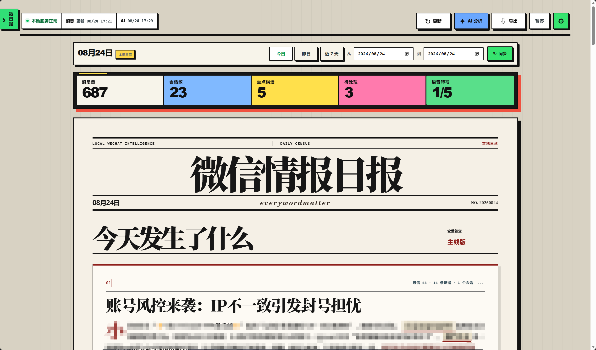
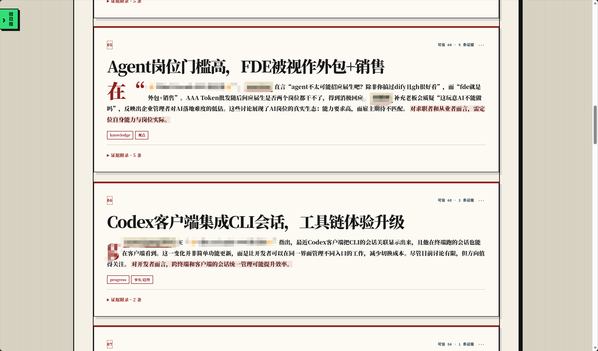
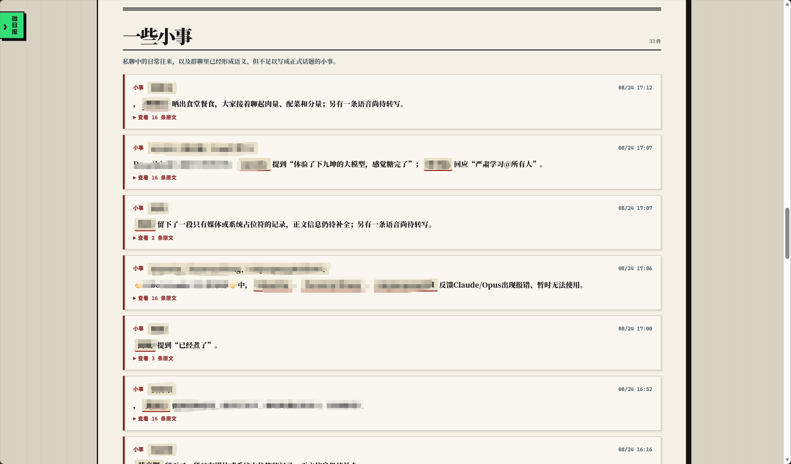
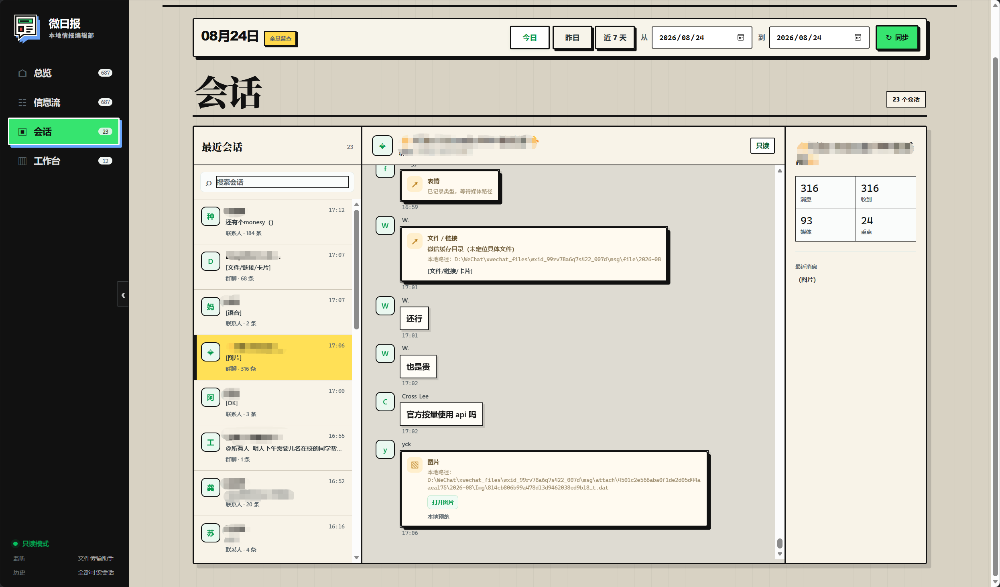
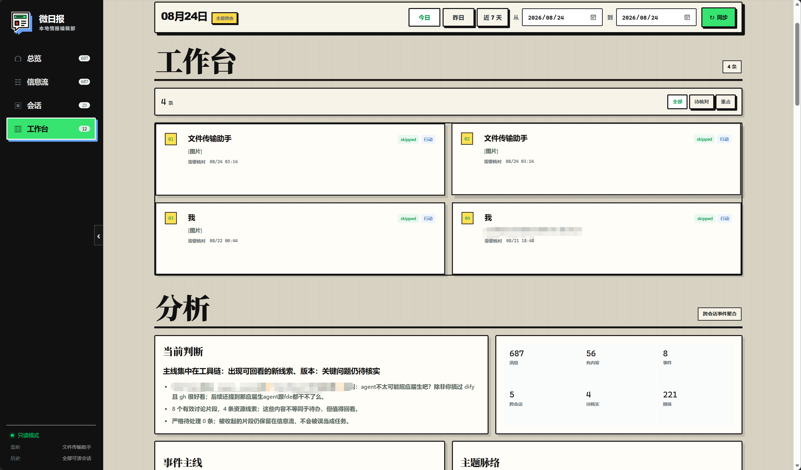

# 微日报

**微日报 0.1.4**——一个面向 Windows 的本地优先微信收发、历史档案与情报分析工作台。

它把本地微信消息整理成可追溯的日报素材：

`微信 → 适配器 → 统一消息 → SQLite → 日/周历史档案 → 可解释分析 → 微日报工作台`

当前版本默认是**只接收、只读分析**：历史导入不会创建回复任务，发送接口保留为预览/测试能力并由运行时硬闸门保护。

[](CHANGELOG.md)
[](https://www.python.org/)
[](desktop/)

---

## 目录

- [特性](#特性)
- [产品预览](#产品预览)
- [下载与发布包](#下载与发布包)
- [功能详解](#功能详解)
- [安装要求](#安装要求)
- [桌面版快速开始](#桌面版快速开始)
- [桌面版新手教程](#桌面版新手教程)
- [微日报工作台](#微日报工作台)
- [桌面端](#桌面端)
- [规则与 AI](#规则与-ai)
- [API 与 Codex 插件](#api-与-codex-插件)
- [数据与隐私](#数据与隐私)
- [项目结构](#项目结构)
- [开发与测试](#开发与测试)
- [当前边界](#当前边界)
- [License](#license)

## 特性

### 📥 本地消息接收

- `wechatauto_db`：读取当前微信 4.x 本地加密数据库的可读消息分片；
- `wxauto4`：保留为显式回退适配器；
- Hook HTTP：保留 `QueryDB/status`、`SendTextMsg` 和 `D0003` 回调适配层；
- 统一消息模型覆盖聊天、发送者、消息类型、群聊标记、媒体键和证据 ID；
- 消息去重、任务状态、重试、发送尝试、错误与确认结果统一落入本地 SQLite。

### 🗂️ 日 / 周历史档案

- 支持今天、近 7 天和自定义日期范围；
- 跨所有可读会话与加密消息分片读取历史，不因重复运行产生重复消息；
- 按 `Asia/Shanghai` 解释日期边界，内部使用半开区间；
- 记录同步范围、进度和最近一次运行状态，便于排查缺口。

### 🧭 可解释情报分析

- 消息量、活跃会话、小时分布和主题概览；
- 重点线索、行动候选、事件时间窗和风险提示；
- 分析结论保留原消息证据 ID，可回链到具体消息；
- 规则支持关键词、正则、聊天/发送者、消息类型、时间段和时区。

### 🖥️ 本地控制台与桌面封装

- 浏览器工作台绑定 `127.0.0.1:8765`，展示档案、摘要、线索和行动候选；
- 消息档案支持筛选、搜索和证据回链；
- Tauri 2 桌面端复用已有本地服务，服务未运行时可启动自己的后端进程；
- 桌面端不开放前端 shell 权限，不传入 `--live`，退出时只关闭自己启动的后端。

### 🧩 Codex 本地插件

`plugins/wechat-bridge` 提供本地 MCP 工具，调用同一套 loopback API，适合在 Codex 中查询状态、消息和分析结果。插件不绕过后端的只读边界。

## 产品预览

下面是微日报本地工作台的实际界面截图。截图中的聊天名称、联系人和部分正文已经模糊处理；图片只用于展示产品布局，不代表仓库会提交任何运行时聊天数据。

| 页面 | 说明 |
| --- | --- |
|  | **总览 / 日报主线**：选择日期范围后查看消息量、会话数、重点候选、待处理项和语音转写进度，并阅读“今天发生了什么”。[查看原图](docs/images/product-preview/overview.png) |
|  | **日报内容页**：把高信号消息排成可阅读的版面，保留主题、判断、标签和证据附录。[查看原图](docs/images/product-preview/daily-edition.png) |
|  | **小事**：保留低信号但可能有后续价值的日常消息，既不把它们混进主线，也不让它们悄悄消失。[查看原图](docs/images/product-preview/small-things.png) |
|  | **会话**：按聊天查看原始消息、图片/文件/语音类型、媒体路径和会话统计，支持回到原始证据。[查看原图](docs/images/product-preview/conversations.png) |
|  | **工作台 / 分析**：集中查看待处理候选、事件主线、主题脉络、当前判断和分析指标；默认只读，不会因为出现候选就自动发送消息。[查看原图](docs/images/product-preview/workbench.png) |

## 下载与发布包

Windows 0.1.4 发布包已经放在本仓库的 [GitHub Release v0.1.4](https://github.com/Sutera-Diffusus/wei-daily/releases/tag/v0.1.4) 中。由于安装包和便携包都超过 GitHub 普通仓库单文件限制，它们作为 Release 资产提供下载，下面的链接可以直接跳转：

- [下载 Windows 安装包](https://github.com/Sutera-Diffusus/wei-daily/releases/download/v0.1.4/wei-daily-0.1.4-windows-installer.exe)：运行安装向导，安装后从开始菜单或桌面快捷方式启动；
- [下载 Windows 便携包](https://github.com/Sutera-Diffusus/wei-daily/releases/download/v0.1.4/wei-daily-0.1.4-windows-portable.zip)：完整解压后运行文件夹内的 `wei-daily-desktop.exe`；
- [查看 Release 页面](https://github.com/Sutera-Diffusus/wei-daily/releases/tag/v0.1.4)：查看版本说明、文件大小和其它校验信息。

下载后可按下面的 SHA256 值核对文件完整性：

| 文件 | SHA256 |
| --- | --- |
| `wei-daily-0.1.4-windows-installer.exe` | `35F66AA45A6B5158D717D011D1D327C42218E340376B97F34313776C4277CFF3` |
| `wei-daily-0.1.4-windows-portable.zip` | `63700BB9F995C9D28185EF32D6FFDB539E9BAF20FF79C83EB00BFAF1CF34DC54` |

## 功能详解

微日报不是一个单纯的聊天记录查看器，而是一条“采集—归档—筛选—解释—复核”的本地工作流。它把消息放进有日期、有来源、有证据的上下文里，让用户先看到值得注意的内容，再随时回到原始消息核对。

### 1. 消息采集：把不同入口统一成一套消息

- `wechatauto_db` 负责读取当前微信 4.x 本地数据库中的可读消息分片；
- `wxauto4` 作为显式回退适配器保留，适合需要通过微信窗口获取消息的环境；
- Hook HTTP 适配层保留 `QueryDB/status`、`SendTextMsg` 和 `D0003` 回调接口，便于接入已有本地桥接服务；
- 不同来源最终都会转换成统一消息模型，包含聊天、发送者、时间、消息类型、群聊标记、媒体键和证据 ID；
- 消息去重、同步进度、任务状态、重试记录、错误和确认结果都写入本地 SQLite，避免同一批历史消息重复出现。

项目的安全边界也很明确：主路径不下载 DLL、不注入微信、不替换微信安装目录文件，接收和分析默认只访问本机数据与 loopback 服务。

### 2. 历史归档：按天、按周、按范围复盘

工作台支持“今天”“近 7 天”和自定义日期范围。日期按照 `Asia/Shanghai` 解释，内部使用半开区间，因此跨午夜和跨天同步时不容易出现边界重复或漏读。

每次同步都会记录范围、进度和最近一次运行状态。适配器会跨可读会话与数据库分片查找历史消息，并通过稳定的消息标识去重。这样既可以每天只抓当天，也可以在第一次使用时补齐近一周的上下文。

### 3. 日报编排：从“消息很多”变成“今天发生了什么”

日报页面会把消息按信号强弱组织成几层内容：

- **主线**：当天最值得先读的主题、变化和事件；
- **重点候选**：可能需要关注、跟进或进一步判断的消息；
- **事件主线**：把同一件事在不同时间、不同会话里的消息串起来；
- **主题脉络**：按关键词、聊天、发送者和消息类型观察讨论集中在哪里；
- **小事**：保留低信号但可能有后续价值的日常消息；
- **证据附录**：为每一条判断保留原始消息证据 ID，支持回到档案核对。

日报不是把模型输出直接当成结论。固定规则先进行本地筛选和打标，分析层计算消息量、活跃会话、小时分布、主题和候选项；如用户主动开启 AI，AI 只做二次整理，且必须引用本地证据编号，无法回链的结论会被丢弃。

### 4. 会话浏览：随时回到原始消息

会话页提供从摘要回到证据的路径：左侧按聊天查找，中间查看消息正文和图片、文件、语音等类型，右侧查看会话统计与相关状态。媒体字段保留本地媒体键或路径，方便在本机进一步核对。

这一步很重要：日报里的“重点”只是帮助排序，用户可以在会话页确认上下文、前后消息和原始发送者，再决定是否把它当成真正的事项。会话浏览本身不会发送消息。

### 5. 工作台：把候选变成可处理事项

工作台把待处理候选、事件主线、主题脉络和分析指标放在同一个视图中。每个候选都应带有来源、时间、规则或分析原因以及证据链接，便于判断“为什么会出现”和“下一步是否需要处理”。

“待处理”“已确认”等状态只代表本地工作台里的整理状态，不等于已经向微信联系人发送了内容。当前版本的 `/api/send-text` 固定返回 403；预览、重试和分析接口也受到服务端健康检查与只读闸门约束。

### 6. 规则与 AI：先本地筛选，再选择性调用

规则文件支持关键词、正则表达式、聊天、发送者、消息类型、时间段和时区。推荐的处理顺序是：

1. 先用规则缩小消息范围并打标签；
2. 再按日期、会话和消息类型查看候选；
3. 回到原始证据确认上下文；
4. 只有确实需要时，手动确认 AI 二次分析；
5. 检查 AI 结果是否能回链到本地证据。

这样可以把隐私暴露和分析成本控制在最小范围。AI 不参与自动回复，不写入消息库，不进入回复队列，也不会因为分析完成而自动触发微信动作。

### 7. 桌面端与 Codex 插件

Tauri 2 桌面端复用同一套本地服务：已有服务运行时直接连接 `127.0.0.1:8765`，未运行时再启动自己的后端进程。桌面端不开放前端 shell 权限，不传入 `--live`，退出时只关闭自己启动的进程。

`plugins/wechat-bridge` 则把状态、近期消息、规则分析和预览能力暴露给 Codex。它调用的仍然是同一套本地 loopback API，因此权限边界、只读模式和发送硬闸门不会因为换了入口而改变。

## 安装要求

### 普通用户

| 项目 | 要求 |
| --- | --- |
| 操作系统 | Windows 10 / 11 |
| 微信 | 已登录，并保持主窗口打开 |
| WebView2 | Windows 桌面端运行时需要；便携包启动前请确认已安装 |

普通用户使用 Windows 安装包或便携包时，不需要安装 Python、Node.js、Rust，也不需要在 PowerShell 中启动后端。安装包会启动随包提供的本地服务；便携包则要求 `wei-daily-desktop.exe` 和 `wei-daily-backend.exe` 保持在同一文件夹。

### 构建者 / 开发者

只有从源码开发或重新构建发布包时，才需要 Python 3.9–3.12、Node.js 18+、Rust stable-msvc 和 Microsoft C++ Build Tools。相关命令放在[桌面端](#桌面端)和[开发与测试](#开发与测试)章节。

当前开发环境以微信 `4.1.12.26` 为主。微信版本、数据库布局和 Hook 行为变化时，适配器可能需要重新验证。

## 桌面版快速开始

微日报发布时提供两种 Windows 形态，普通用户二选一即可。

### A. Windows 安装包（推荐）

双击 `微日报_0.1.4_x64-setup.exe`，按安装向导完成安装，再从开始菜单或桌面快捷方式启动“微日报”。安装包会把桌面主程序和后端 sidecar 一起安装，用户不需要单独寻找或启动后端 exe。

构建产物默认位于：

```text
desktop/src-tauri/target/release/bundle/nsis/微日报_0.1.4_x64-setup.exe
```

### B. Windows 便携包

解压 `微日报-便携版-0.1.4-win-x64.zip`，保持整个文件夹结构不变，然后双击文件夹里的 `wei-daily-desktop.exe`。便携包不需要运行安装程序，也不需要 Python。

便携包的正确结构是：

```text
微日报-便携版-0.1.4-win-x64/
├─ wei-daily-desktop.exe    # 用户双击这个桌面主程序
├─ wei-daily-backend.exe    # 内置本地服务，必须与主程序同目录
├─ 使用说明.md
├─ SHA256SUMS.txt
└─ version.txt
```

不要直接双击 `wei-daily-backend.exe`，也不要只复制 `wei-daily-desktop.exe` 出来运行；主程序会自动按需拉起同目录的后端 sidecar。

便携包构建产物默认位于：

```text
output/portable/微日报-便携版-0.1.4-win-x64.zip
output/portable/微日报-便携版-0.1.4-win-x64/
```

### 关于 `127.0.0.1:8765`

桌面端内部仍使用 `127.0.0.1:8765` 作为主程序与内置后端之间的本机回环通信地址，但这是桌面程序自动管理的内部服务：普通用户不需要打开 PowerShell、不需要执行 Python 命令、不需要手动打开浏览器或“启动端口”。双击桌面 exe 后，程序会等待服务就绪，再自动进入工作台；退出时只关闭自己启动的后端。

如果提示端口被占用，通常是已有的微日报实例或旧的本地服务仍在运行。先关闭其它微日报窗口，再重新启动；不要通过启动第二个后端来解决。

## 桌面版新手教程

下面是面向拿到安装包或便携包后的第一次使用流程。源码命令属于开发者流程，不是普通用户的安装步骤。

### 第 1 步：准备微信

1. 登录 Windows 版微信；
2. 保持微信主窗口打开，不要在首次同步过程中退出微信；
3. 确认需要查看的聊天已经在本机微信中可读。

### 第 2 步：选择一种发布方式

- **安装包**：运行 `微日报_0.1.4_x64-setup.exe`，安装后使用快捷方式启动；
- **便携包**：完整解压 `微日报-便携版-0.1.4-win-x64.zip`，只运行其中的 `wei-daily-desktop.exe`。

两种方式不要混用同一份正在运行的后端。便携包中的两个 exe 必须同目录，压缩包不能只解出其中一个文件。

### 第 3 步：第一次启动

双击桌面主程序后，先看到“正在等待本机服务”属于正常现象。桌面端会自动启动随包后端并检查健康状态，准备完成后自动打开微日报工作台。

此时不需要：

- 手动运行 `wechat_bridge run`；
- 手动打开 <http://127.0.0.1:8765>；
- 打开或配置 Node.js、Python 虚拟环境；
- 直接启动 `wei-daily-backend.exe`。

### 第 4 步：完成第一次同步

1. 在工作台选择“今天”；
2. 点击“抓取当前范围”，等待同步状态变为完成；
3. 查看消息总量、会话数和同步状态，确认数据已经进入本地工作台；
4. 回到“日报主线”，阅读“今天发生了什么”；
5. 再打开证据附录或“会话”，核对重点候选对应的原始消息；
6. 当“今天”运行正常后，再尝试“近 7 天”或自定义日期范围。

第一次同步可能需要更久，因为后端要扫描可读数据库分片并建立本地索引。同步期间不要重复点击启动程序，也不要移动便携包文件夹。

### 第 5 步：按顺序使用页面

推荐顺序是“总览 → 日报主线 → 证据附录 → 会话 → 工作台 / 分析 → 小事”。日报里的重点候选是帮助排序的结果，不是自动决策；需要处理的事项应先回到原始消息确认上下文。

固定规则可以直接使用，不配置 AI 也不影响日报和历史档案。如果确实需要 AI 二次分析，请在工作台中手动确认，并检查结果是否带有可回链的本地证据 ID。AI 不会自动发送微信消息。

### 第 6 步：退出程序

直接关闭微日报桌面窗口即可。桌面端只会关闭它自己启动的后端，不会强制关闭用户此前已经运行的其它本地服务。便携包中的数据库和运行数据按桌面端约定写入 Windows 应用数据目录，不会写进安装目录或要求把数据放在 exe 旁边。

### 常见问题

| 现象 | 处理方式 |
| --- | --- |
| 双击后一直等待服务 | 确认微信已登录且主窗口打开；关闭其它微日报实例后重新启动。 |
| 提示端口被占用 | 关闭旧的微日报桌面程序或其它本地服务，不要再手动启动第二个后端。 |
| 便携包提示找不到后端 | 重新完整解压 zip，确认 `wei-daily-desktop.exe` 与 `wei-daily-backend.exe` 在同一目录，不要只复制主程序。 |
| 页面空白或 WebView2 缺失 | 安装 Microsoft Edge WebView2 Runtime；安装包可重新运行，便携包需要系统先具备 WebView2。 |
| 同步完成但没有消息 | 确认微信登录状态、日期范围和聊天可读性，再重新抓取当前范围。 |
| 想确认文件是否损坏 | 在便携包目录执行 `Get-FileHash wei-daily-desktop.exe -Algorithm SHA256`，并与 `SHA256SUMS.txt` 对照。 |

## 微日报工作台

### 工作流

1. 启动微信并确认登录状态；
2. 双击安装包创建的微日报快捷方式，或双击便携包中的 `wei-daily-desktop.exe`；
3. 等待桌面端自动启动本地后端并打开工作台；
4. 在工作台选择日期范围并执行“抓取当前范围”；
5. 先查看同步状态，再阅读重点线索和行动候选；
6. 通过证据 ID 回到消息档案核对原文；
7. 需要长期保留的结论在工作台外另行整理，数据库仍只作为本地运行数据。

### 服务接口

```text
GET  /api/status
GET  /api/messages?limit=50
GET  /api/messages?start=YYYY-MM-DD&end=YYYY-MM-DD&limit=50000
GET  /api/tasks?limit=50
GET  /api/rules
GET  /api/accounts
GET  /api/insights?start=YYYY-MM-DD&end=YYYY-MM-DD
GET  /api/chats?start=YYYY-MM-DD&end=YYYY-MM-DD
GET  /api/sync-status
GET  /api/ai-status
POST /api/auto-reply       {"enabled": false}
POST /api/preview          {"content": "..."}
POST /api/sync             {"limit": 100}
POST /api/sync-range       {"start":"YYYY-MM-DD","end":"YYYY-MM-DD","scope":"all"}
POST /api/ai-analysis      {"start":"YYYY-MM-DD","end":"YYYY-MM-DD","limit":120,"confirm":true}
POST /api/retry            {"task_id": 1}
POST /api/send-text        {"content": "...", "confirm": true}
```

服务只绑定 `127.0.0.1`，不会返回 API Key。当前只读模式下，`/api/send-text` 固定返回 403；`/api/preview` 不创建任务，历史同步不会创建回复任务。

## 桌面端

桌面封装位于 [`desktop/`](desktop)，使用 Tauri 2。发布版会随桌面主程序携带 PyInstaller sidecar：若 `127.0.0.1:8765/api/status` 已可用，则直接复用；否则自动启动随包后端。这个地址只用于本机回环通信，普通用户不需要手动打开。

### 开发运行

```powershell
cd desktop
npm install
npm run icons
npm run dev
```

可通过 `WEI_DAILY_PROJECT_ROOT` 指定 Python 项目根目录；默认解析为桌面端目录的上两级。

### 构建 Windows 安装包

```powershell
cd desktop
npm install
npm run build
```

构建流程会生成品牌图标、构建 `wei-daily-backend` sidecar，再生成 NSIS 安装包。构建产物、sidecar 和 Tauri target 均不会提交到仓库。

NSIS 安装包默认位于：

```text
desktop/src-tauri/target/release/bundle/nsis/微日报_0.1.4_x64-setup.exe
```

### 构建 Windows 便携包

先完成一次 `npm run build`，再回到项目根目录执行：

```powershell
powershell -ExecutionPolicy Bypass -File .\desktop\scripts\build-portable.ps1 -LaunchTest
```

脚本会生成完整的便携包目录和 zip：

```text
output/portable/微日报-便携版-0.1.4-win-x64/
├─ wei-daily-desktop.exe
├─ wei-daily-backend.exe
├─ 使用说明.md
├─ SHA256SUMS.txt
└─ version.txt

output/portable/微日报-便携版-0.1.4-win-x64.zip
```

`-LaunchTest` 会启动便携版主程序做短时存活检查；脚本只会重建明确的 `output/portable` 目录，不会删除项目源码或运行数据。

## 规则与 AI

本节中的 PowerShell 命令面向源码开发和重新构建发布包；普通用户使用桌面安装包或便携包时不需要执行这些命令。

### 规则配置

复制示例后按需修改：

```powershell
Copy-Item config\rules.example.json config\rules.json
```

启动时指定规则文件：

```powershell
.\.venv\Scripts\python.exe -m wechat_bridge run `
  --rules-file config\rules.json `
  --chat "文件传输助手" `
  --dashboard
```

规则按文件顺序匹配，命中第一条后停止。布尔字段必须使用 JSON `true/false`，字符串 `"false"` 会被拒绝。

### AI 辅助分析

AI 是手动二次筛选，不是自动回复。使用前设置：

```powershell
$env:OPENAI_API_KEY = "你的 API Key"
```

然后在工作台中手动确认 AI 分析。服务会把有限字段和证据编号交给配置的 AI 服务，结果必须回链到本地证据 ID；无法回链的结论会被丢弃。分析结果不写入消息库、不入回复队列，也不会自动发送微信。

## API 与 Codex 插件

插件目录为 [`plugins/wechat-bridge`](plugins/wechat-bridge)。它提供：

- `wechat.status`
- `wechat.recent_messages`
- `wechat.enable_auto_reply`
- `wechat.disable_auto_reply`
- `wechat.reply_preview`
- `wechat.retry_message`
- `wechat.send_text`

插件调用仍受服务端 dry-run、健康检查和目标闸门约束；工具名称不代表当前版本已经开放自动发送。

## 数据与隐私

- `data/` 保存本地数据库、同步状态和 QA 浏览器 profile，已整体加入 `.gitignore`；
- `tmp/`、`output/`、`wechatauto_logs/` 保存运行日志、截图、PDF 和安装包等本地产物，不提交；
- 仓库不包含微信数据库、聊天记录、Cookie、浏览器登录数据、API Key 或个人配置；
- AI 分析只有在用户手动确认后才会把有限候选文本发送到配置的 AI 服务；
- 普通接收、历史同步、规则分析和桌面端均只访问本机服务；
- 发现安全问题请参阅 [`SECURITY.md`](SECURITY.md)。

## 项目结构

```text
wei-daily/
├─ src/wechat_bridge/           # Python 服务、适配器、存储、分析与 Web 工作台
│  ├─ adapters/                 # wechatauto_db / wxauto4 / Hook HTTP
│  └─ web/                      # 本地控制台前端与品牌资源
├─ desktop/                     # Tauri 2 桌面端与 PyInstaller sidecar 构建脚本
│  ├─ src/                      # 桌面等待页与本地服务启动逻辑
│  └─ src-tauri/                # Rust 容器、权限和安装包配置
├─ plugins/wechat-bridge/      # Codex 本地 MCP 插件
├─ tests/                       # 规则、同步、适配器、分析和 API 测试
├─ docs/                        # 设计评审、实现资料与产品预览图
│  └─ images/product-preview/   # README 中的界面截图
├─ config/rules.example.json   # 可复制的规则配置示例
├─ pyproject.toml
├─ CHANGELOG.md
├─ CONTRIBUTING.md
├─ SECURITY.md
└─ LICENSE
```

## 开发与测试

安装开发依赖并运行测试：

```powershell
.\.venv\Scripts\python.exe -m pip install -e .
.\.venv\Scripts\python.exe -m pytest -q
.\.venv\Scripts\python.exe -m pip check
```

测试覆盖规则和时区、AI 缺失配置、消息去重、任务恢复、跨分片数据库适配器、历史同步、可解释分析、只读发送闸门、控制台 API、媒体和语音流水线等。

提交前请确认：

- `git status` 中没有 `data/`、`tmp/`、`output/`、浏览器 profile 或日志；
- 没有 `.env`、私钥、Cookie、数据库或安装包；
- 公开到其他环境的日志和截图已经脱敏；
- 相关测试和 `pip check` 已通过。

更完整的修改约定见 [`CONTRIBUTING.md`](CONTRIBUTING.md)。

## 当前边界

- 当前版本的主运行路径是接收与分析，不是无人值守自动回复；
- 微信 `4.1.12.26` 的 Hook DLL 匹配尚未在本项目中验证，不能把公开的其他版本 Hook 目标视为兼容；
- 项目不会下载 DLL、注入微信或替换微信安装目录文件；
- `wxauto4` 作为回退适配器保留，实际可用性取决于本机微信窗口和依赖版本；
- 微信数据库、媒体和语音格式属于第三方应用内部实现，升级微信后需要重新运行诊断和测试。

## License

[MIT](LICENSE)

---

**把零散消息整理成今天真正有用的几行。** 🗞️
